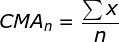
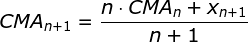

# Cumulative Moving Average

## About
* Added in: [0.1.0](https://github.com/wuhkuh/talib/releases/tag/0.1.0)
* Type: Trend indicator

## Research

#### Sources

| Type        | Name                      | By     | Retrieved at | Reference |
| :---------- | :------------------------ | :----- | :----------: | :-------: |
| **Primary** | **Could not be found!**   |        |              |           |
| Tertiary    | Cumulative Moving Average | RTMath |  2017-08-20  | [Reference](https://rtmath.net/helpFinAnalysis/html/f90144b2-8ccb-4eeb-a622-4bd1ff87feb4.htm) |

Sources are ordered by type and trustworthiness.

#### Derived formula

To calculate the next CMA, this formula is used:  

Where n is the current weight and x is the current value (usually price).

## Pseudo-code
