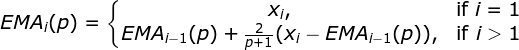
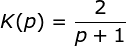

# Exponential Moving Average

## About

* Added in: [0.1.0](https://github.com/wuhkuh/talib/releases/tag/0.1.0)
* Type: Trend indicator

## Research

### Sources

| Type        | Name                       | By                      | Retrieved at | Reference |
| :---------- | :------------------------- | :---------------------- | :----------: | :-------: |
| **Primary** | **Could not be found!**    |                         |              |           |
| Tertiary    | Examining the EMA          | Technical Analysis Inc. |  2017-08-21  | [Reference](https://www.fidelity.com/bin-public/060_www_fidelity_com/documents/ExaminingEMA.pdf) |
| Tertiary    | Exponential Moving Average | RTMath                  |  2017-08-21  | [Reference](https://rtmath.net/helpFinAnalysis/html/4aacce13-de81-44bd-9c39-1cdf946056f9.htm) |
| Tertiary    | Reference/ema              | KX.com                  |  2017-08-21  | [Reference](http://code.kx.com/wiki/Reference/ema) |

Sources are ordered by type and trustworthiness.

### Derived formula

To calculate `K`, this formula is used:

Where `i` is the index, `p` is the assigned period and `x` is the value,  
usually price.

### Unit tests

<table>
  <tr>
    <th>Input</th>
    <td>22.27000</td>
    <td>22.19000</td>
    <td>22.08000</td>
    <td>22.17000</td>
    <td>22.18000</td>
    <td>22.13000</td>
    <td>22.23000</td>
    <td>22.43000</td>
    <td>22.24000</td>
    <td>22.29000</td>
  </tr>
  <tr>
    <th>Output</th>
    <td>22.27000</td>
    <td>22.25545</td>
    <td>22.22355</td>
    <td>22.21382</td>
    <td>22.20767</td>
    <td>22.19355</td>
    <td>22.20017</td>
    <td>22.24196</td>
    <td>22.24160</td>
    <td>22.25040</td>
  </tr>
  <tr>
    <th>Period</th>
    <td>10</td>
  </tr>
  <tr>
    <th><a href=http://code.kx.com/wiki/Reference/ema>Reference</a></th>
  </tr>
</table>

## Pseudo-code
