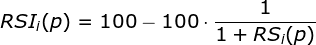
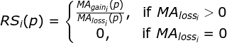
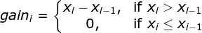

# Relative Strength Index

## About

* Added in: [0.1.0](https://github.com/wuhkuh/talib/releases/tag/0.1.0)
* Type: Supply/Demand indicator

## Research

### Sources

| Type        | Name                                         | By                    | Retrieved at | Reference |
| :---------- | :------------------------------------------- | :-------------------- | :----------: | :-------: |
| **Primary** | New Concepts in Technical Analysis Systems   | J. Welles Wilder, Jr. |  2017-08-21  | [Reference](http://books.mec.biz/tmp/books/218XOTBWY3FEW2CT3EVR.PDF) |

Sources are ordered by type and trustworthiness.

### Derived formula

RSI is based on Relative Strength, shown in the formula below.

Relative Strength can return NaN if not used carefully. Therefore, a piecewise  
function should prevent returning NaN when average loss equals 0.

These moving averages are based on Wilder's Moving Average, often known as  
SMMA.

Where `i` is the index, `p` is the assigned period and `x` is the value,  
usually price.

### Unit tests

<table>
  <tr>
    <th>Input</th>
    <td>54.80</td>
    <td>56.80</td>
    <td>57.85</td>
    <td>59.85</td>
    <td>60.57</td>
    <td>61.10</td>
    <td>62.17</td>
    <td>60.60</td>
    <td>62.35</td>
    <td>62.15</td>
    <td>62.35</td>
    <td>61.45</td>
    <td>62.80</td>
    <td>61.37</td>
    <td>62.50</td>
    <td>62.57</td>
    <td>60.80</td>
    <td>59.37</td>
    <td>60.35</td>
    <td>62.35</td>
    <td>62.17</td>
    <td>62.55</td>
    <td>64.55</td>
    <td>64.37</td>
    <td>65.30</td>
    <td>64.42</td>
    <td>62.90</td>
    <td>61.60</td>
    <td>62.05</td>
    <td>60.05</td>
    <td>59.70</td>
    <td>60.90</td>
    <td>60.25</td>
    <td>58.27</td>
    <td>58.70</td>
    <td>57.72</td>
    <td>58.10</td>
    <td>58.20</td>
  </tr>
  <tr>
    <th>Output</th>
    <td>NA</td>
    <td>NA</td>
    <td>NA</td>
    <td>NA</td>
    <td>NA</td>
    <td>NA</td>
    <td>NA</td>
    <td>NA</td>
    <td>NA</td>
    <td>NA</td>
    <td>NA</td>
    <td>NA</td>
    <td>NA</td>
    <td>NA</td>
    <td>74.36</td>
    <td>74.55</td>
    <td>65.75</td>
    <td>59.68</td>
    <td>61.98</td>
    <td>66.44</td>
    <td>65.75</td>
    <td>67.00</td>
    <td>71.43</td>
    <td>70.50</td>
    <td>72.14</td>
    <td>67.95</td>
    <td>60.78</td>
    <td>55.56</td>
    <td>56.71</td>
    <td>49.49</td>
    <td>48.19</td>
    <td>52.38</td>
    <td>50.00</td>
    <td>43.50</td>
    <td>45.36</td>
    <td>42.53</td>
    <td>44.13</td>
    <td>44.75</td>
  </tr>
  <tr>
    <th>Period</th>
    <td>14</td>
  </tr>
  <tr>
    <th><a href=http://books.mec.biz/tmp/books/218XOTBWY3FEW2CT3EVR.PDF>Reference</a></th>
  </tr>
</table>

## Pseudo-code
