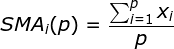

# Simple Moving Average

## About

* Added in: [0.1.0](https://github.com/wuhkuh/talib/releases/tag/0.1.0)
* Type: Trend indicator

## Research

### Sources

| Type        | Name                      | By     | Retrieved at | Reference |
| :---------- | :------------------------ | :----- | :----------: | :-------: |
| **Primary** | **Could not be found!**   |        |              |           |
| Tertiary    | Simple Moving Average     | RTMath |  2017-08-22  | [Reference](https://rtmath.net/helpFinAnalysis/html/c35b686b-4d4d-4783-896b-b4af13da9b91.htm) |
| Tertiary    | Simple Moving Average     | QKDB   |  2017-08-22  | [Reference](https://qkdb.wordpress.com/tag/sma/) |

Sources are ordered by type and trustworthiness.

### Derived formula

Where `i` is the index, `p` is the assigned period and `x` is the value, usually price.

### Unit tests

<table>
  <tr>
    <th>Input</th>
    <td>9.00000</td>
    <td>10.00000</td>
    <td>11.00000</td>
    <td>12.00000</td>
    <td>13.00000</td>
    <td>14.00000</td>
    <td>15.00000</td>
  </tr>
  <tr>
    <th>Output</th>
    <td>NA</td>
    <td>NA</td>
    <td>NA</td>
    <td>NA</td>
    <td>11.00000</td>
    <td>12.00000</td>
    <td>13.00000</td>
  </tr>
  <tr>
    <th>Period</th>
    <td>5</td>
  </tr>
  <tr>
    <th><a href=https://qkdb.wordpress.com/tag/sma/>Reference</a></th>
  </tr>
</table>

## Pseudo-code
