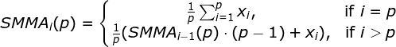

# Smoothed Moving Average

## About

* Added in: [0.1.0](https://github.com/wuhkuh/talib/releases/tag/0.1.0)
* Type: Trend indicator

## Research

### Sources

| Type        | Name                                         | By                    | Retrieved at | Reference |
| :---------- | :------------------------------------------- | :-------------------- | :----------: | :-------: |
| **Primary** | New Concepts in Technical Analysis Systems   | J. Welles Wilder, Jr. |  2017-08-23  | [Reference](http://books.mec.biz/tmp/books/218XOTBWY3FEW2CT3EVR.PDF) |
| Tertiary    | Smoothed Moving Average (SMMA)               | MetaTrader5           |  2017-08-23  | [Reference](https://www.metatrader5.com/en/terminal/help/indicators/trend_indicators/ma) |

Sources are ordered by type and trustworthiness.

### Derived formula

Where `i` is the index, `p` is the assigned period and `x` is the value,  
usually price.

### Unit tests

<table>
  <tr>
    <th>Input</th>
    <td>NA</td>
    <td>2.00</td>
    <td>1.05</td>
    <td>2.00</td>
    <td>0.72</td>
    <td>0.53</td>
    <td>1.07</td>
    <td>0.00</td>
    <td>1.75</td>
    <td>0.00</td>
    <td>0.20</td>
    <td>0.00</td>
    <td>1.35</td>
    <td>0.00</td>
    <td>1.13</td>
    <td>0.07</td>
    <td>0.00</td>
    <td>0.00</td>
    <td>0.98</td>
    <td>2.00</td>
    <td>0.00</td>
    <td>0.38</td>
    <td>2.00</td>
    <td>0.00</td>
    <td>0.93</td>
    <td>0.00</td>
    <td>0.00</td>
    <td>0.00</td>
    <td>0.45</td>
    <td>0.00</td>
    <td>0.00</td>
    <td>1.20</td>
    <td>0.00</td>
    <td>0.00</td>
    <td>0.43</td>
    <td>0.00</td>
    <td>0.38</td>
    <td>0.10</td>
  </tr>
  <tr>
    <th>Output</th>
    <td>NA</td>
    <td>NA</td>
    <td>NA</td>
    <td>NA</td>
    <td>NA</td>
    <td>NA</td>
    <td>NA</td>
    <td>NA</td>
    <td>NA</td>
    <td>NA</td>
    <td>NA</td>
    <td>NA</td>
    <td>NA</td>
    <td>NA</td>
    <td>0.84</td>
    <td>0.79</td>
    <td>0.73</td>
    <td>0.68</td>
    <td>0.70</td>
    <td>0.79</td>
    <td>0.73</td>
    <td>0.71</td>
    <td>0.80</td>
    <td>0.74</td>
    <td>0.75</td>
    <td>0.70</td>
    <td>0.65</td>
    <td>0.60</td>
    <td>0.59</td>
    <td>0.55</td>
    <td>0.51</td>
    <td>0.56</td>
    <td>0.62</td>
    <td>0.48</td>
    <td>0.48</td>
    <td>0.45</td>
    <td>0.45</td>
    <td>0.43</td>
  </tr>
  <tr>
    <th>Period</th>
    <td>14</td>
  </tr>
  <tr>
    <th><a href=http://books.mec.biz/tmp/books/218XOTBWY3FEW2CT3EVR.PDF>Reference</a></th>
  </tr>
</table>

<table>
  <tr>
    <th>Input</th>
    <td>NA</td>
    <td>0.00</td>
    <td>0.00</td>
    <td>0.00</td>
    <td>0.00</td>
    <td>0.00</td>
    <td>0.00</td>
    <td>1.57</td>
    <td>0.00</td>
    <td>0.20</td>
    <td>0.00</td>
    <td>0.90</td>
    <td>0.00</td>
    <td>1.43</td>
    <td>0.00</td>
    <td>0.00</td>
    <td>1.77</td>
    <td>1.43</td>
    <td>0.00</td>
    <td>0.00</td>
    <td>0.18</td>
    <td>0.00</td>
    <td>0.00</td>
    <td>0.18</td>
    <td>0.00</td>
    <td>0.88</td>
    <td>1.52</td>
    <td>1.30</td>
    <td>0.00</td>
    <td>2.00</td>
    <td>0.35</td>
    <td>0.00</td>
    <td>0.65</td>
    <td>1.98</td>
    <td>0.00</td>
    <td>0.98</td>
    <td>0.00</td>
    <td>0.00</td>
  </tr>
  <tr>
    <th>Output</th>
    <td>NA</td>
    <td>NA</td>
    <td>NA</td>
    <td>NA</td>
    <td>NA</td>
    <td>NA</td>
    <td>NA</td>
    <td>NA</td>
    <td>NA</td>
    <td>NA</td>
    <td>NA</td>
    <td>NA</td>
    <td>NA</td>
    <td>NA</td>
    <td>0.29</td>
    <td>0.27</td>
    <td>0.38</td>
    <td>0.46</td>
    <td>0.43</td>
    <td>0.40</td>
    <td>0.38</td>
    <td>0.35</td>
    <td>0.32</td>
    <td>0.31</td>
    <td>0.29</td>
    <td>0.33</td>
    <td>0.42</td>
    <td>0.48</td>
    <td>0.45</td>
    <td>0.56</td>
    <td>0.55</td>
    <td>0.51</td>
    <td>0.52</td>
    <td>0.62</td>
    <td>0.58</td>
    <td>0.61</td>
    <td>0.57</td>
    <td>0.53</td>
  </tr>
  <tr>
    <th>Period</th>
    <td>14</td>
  </tr>
  <tr>
    <th><a href=http://books.mec.biz/tmp/books/218XOTBWY3FEW2CT3EVR.PDF>Reference</a></th>
  </tr>
</table>

## Pseudo-code
